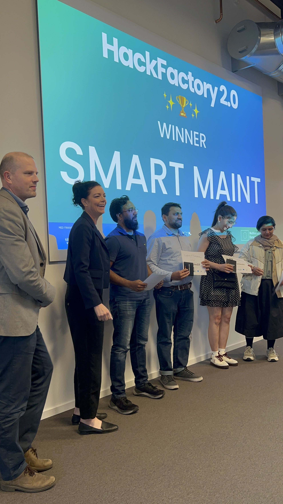

# Predictive Maintenance for Smart Factories - Hackfactory 2.0 Winner

**Winner of the Hackfactory 2.0 Challenge – an Industry 4.0 Hackathon hosted by MITC - Mälardalen Industrial Technology Center, on Jun 10th, 2025.**

This project is a real-time predictive maintenance solution that uses a hybrid anomaly detection model to identify potential equipment failures in a smart factory setting. The solution was developed in less than 24 hours and provides a single, intuitive cockpit for monitoring sensor data and receiving real-time alerts.

## Hackathon Day

<p align="center">
  
</p>

## The Challenge

The hackathon challenge was to reimagine predictive maintenance in smart factories. We were given a dataset of sensor data from a manufacturing process and tasked with building a solution that could predict equipment failures in real-time.

## Our Solution

Our solution is a real-time, demo-able application that brings together IoT sensor data and predictive analytics into a single, intuitive cockpit. The core of our solution is a hybrid anomaly detection model that combines the strengths of two different machine learning models:

*   **Isolation Forest (IF):** A tree-based model that is effective at identifying global anomalies.
*   **Autoencoder (AE):** A neural network-based model that is effective at identifying local anomalies.

By combining these two models, we are able to create a more robust and accurate anomaly detection system that can identify a wider range of potential equipment failures.

## Key Features

*   **Real-time anomaly detection:** The application can process sensor data in real-time and identify anomalies as they occur.
*   **Hybrid anomaly detection model:** The use of a hybrid model improves the accuracy and robustness of the anomaly detection system.
*   **Intuitive dashboard:** The application includes a web-based dashboard that provides a real-time view of the sensor data and any detected anomalies.
*   **Scalable architecture:** The application is built on a scalable architecture that can be easily adapted to handle larger datasets and more complex models.

## Technical Deep Dive

### Data Analysis and Feature Engineering

The first step in our process was to analyze the provided sensor data and perform feature engineering. We used the `ml-model-analysis.ipynb` notebook to perform this analysis. The key steps in this process were:

*   **Data loading and cleaning:** We loaded the data from the `data.csv` file and performed basic data cleaning tasks, such as handling missing values.
*   **Exploratory data analysis (EDA):** We performed EDA to understand the distribution of the data and identify any potential relationships between the different sensor readings.
*   **Feature engineering:** We created a new feature, `temp_diff`, which is the difference between the two temperature sensors. This feature proved to be a strong indicator of anomalies.

### Anomaly Detection Models

We used two different machine learning models for anomaly detection:

*   **Isolation Forest (IF):** We trained an Isolation Forest model on the sensor data. The model was able to identify a number of global anomalies, which are data points that are far from the rest of the data.
*   **Autoencoder (AE):** We also trained an Autoencoder model on the sensor data. The model was able to identify a number of local anomalies, which are data points that are anomalous with respect to their neighbors.

### Hybrid Approach

We combined the predictions from the Isolation Forest and Autoencoder models to create a hybrid anomaly detection system. This approach allowed us to identify a wider range of anomalies and improve the overall accuracy of our system. The `anomaly_summary.csv` file shows the number of anomalies detected by each model and the hybrid model.

## Real-Time Demo Application

The real-time demo application is composed of three main components:

*   **`data-streamer.py`:** This script simulates a real-time stream of sensor data by reading data from a CSV file and sending it to the `visual-app.py` application via a REST API.
*   **`realtime-anomaly-detection.py`:** This script contains the core logic for the real-time anomaly detection system. It receives sensor data from the `data-streamer.py` script, processes it using the trained machine learning models, and identifies any anomalies.
*   **`visual-app.py`:** This script provides a web-based dashboard for visualizing the sensor data and any detected anomalies. The dashboard is built using the Dash library and provides a real-time view of the data.

## Visualizations

The `ml-model-analysis.ipynb` notebook will generate a number of visualizations that provide insights into the data and the performance of the machine learning models. These visualizations will be saved in the `figures` directory.

## Data Privacy

Please note that the dataset used for this project is not publicly available due to industrial regulations and GDPR. The `data.csv` file in this repository is a sample file with the same structure as the original dataset, but with dummy data. The `realtime_demo_data.csv` file is also a sample file with dummy data.

## How to Run the Demo

To run the demo application, you will need to have Python and the following libraries installed:

*   pandas
*   requests
*   scikit-learn
*   tensorflow
*   flask
*   dash
*   plotly

Once you have installed the required libraries, you can run the application by following these steps:

1.  Start the `visual-app.py` application by running the following command in your terminal:

    ```bash
    python demo-app/visual-app.py
    ```

2.  In a separate terminal, start the `data-streamer.py` script:

    ```bash
    python demo-app/data-streamer.py
    ```

3.  Open a web browser and navigate to `http://localhost:8050/dashboard/` to view the real-time dashboard.

## Future Improvements

*   **Deploy the application to a cloud platform:** This would allow the application to be accessed from anywhere and would make it more scalable.
*   **Integrate with a real-time data streaming platform:** This would allow the application to process data from a real-time data source, such as a Kafka topic or a Kinesis stream.
*   **Develop a more sophisticated user interface:** The current user interface is very basic. A more sophisticated user interface could provide more features, such as the ability to drill down into the data and view historical trends.

## Author

*   Shibbir Ahmed
